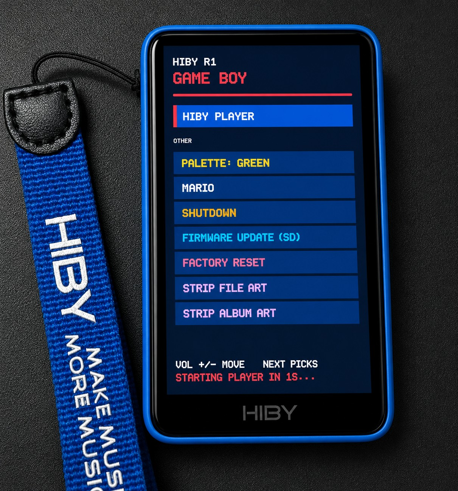

**Please remember:** this is a community reverse-engineering mod, not an official HiBy release. Everything below was verified by diffing a full unpacked stock rootfs against the modded one, file by file. Test it, break it, report back. Also, I'm not a developer — I'm just a **curious reverse-engineering addict** who can't resist poking at firmware to see what happens. 😄

I basically flip every switch I can find, cross my fingers, and release the modded firmware into the wild. There's no way I can test every single feature or setting on my own. So think of this as a community experiment: you break it, test it, report it, and together we'll figure out what actually works and what still needs tweaking. Every bug report, success story, and weird discovery helps make the next release better. Without your feedback, I'm just a guy enthusiastically pressing random buttons in an editor.
>I am currently raising funds to purchase other HiBy devices to expand this modding ecosystem.
> 
> ### 🎯 Target: $200 USD
> Your support directly funds the purchase of hardware for reverse engineering and firmware testing. Next Targeted devicees - Hiby R3 Pro II, Hiditzs AP80 Pro-X, Tempotec V1 and others
> 
> **💖 [Sponsor me on GitHub](https://github.com/sponsors/bidhata?frequency=one-time&sponsor=bidhata)**
>
> via **USDT :** 0xcb6989985389f0a983bb20582d97e665128735e1 ( BEP20 )
>
> via **Paypal :** bidhata@gmail.com 
>
> **Every dollar keeps this project alive and motivates future updates!**

---

# 🎶+🎮 HiBy R1 — Game Boy Edition (v1.8 b2)

Custom firmware for the **HiBy R1** portable music player that adds a full **Game Boy / Game Boy Color emulator** to the boot menu, \tunes storage/DAC settings HiBy ships conservative or disabled.

Device runs HiBy Linux on an **Ingenic X1600** MIPS32 SoC.

---

## Quick Install

1. Download `r1.upt` (built from this repo — see [Building the Image](#building-the-image) below if you need to build your own) and copy it to the **root of your SD card**.
2. On the R1: **Settings → Firmware Update → Via SD-card**. Confirm "Update system firmware?".
3. Device reboots twice. On the second boot you'll land on the **GAME BOY launcher menu** instead of the music player — that's confirmation the modded firmware took.
4. Pick **MUSIC PLAYER** from the menu to use the device exactly as before. Nothing about `hiby_player` itself was touched.


---

## 🚀 What's New in This Build

### 1. Game Boy / GBC Emulator + Boot Launcher

The headline feature. A complete DMG/CGB emulator, written from scratch (`gb-emu/`, ~15 source files), cross-compiled to a static MIPS32r2 binary and wired into the boot chain in place of the music player.

| Component | Detail |
|---|---|
| CPU | Full LR35902 — all 256 base + 256 CB-prefixed opcodes, cycle-interleaved memory access (timer/PPU reads mid-instruction are hardware-accurate) |
| PPU | Background, window, sprite rendering; CGB tile attributes, both VRAM banks, HDMA/GDMA, double-speed mode |
| APU | All 4 channels (2 square, wave, noise) → ALSA where available |
| Mappers | MBC1, MBC2, MBC3 (+RTC), MBC5 |
| Saves | Battery-backed `.sav`, written next to the ROM |
| Video | Direct `/dev/fb0` mmap, 16/32bpp, 160×144 scaled + centered |
| DMG Palettes | 4 selectable shades — green, grey, pocket, amber (GBC titles use their own colors) |

Verified against Blargg's test-ROM suite: passes `cpu_instrs`, `instr_timing`, `mem_timing`, `mem_timing-2`; pixel-perfect on `cgb-acid2`. Known gap: the HALT bug isn't emulated (`halt_bug.gb` fails — very few commercial games depend on it).

**Boot flow:** stock chain is `inittab → rcS → S92_03_start_music_player → hiby_player.sh`. The mod repoints that init script's `PL01=` line at `gb-launcher.sh`. If the emulator ever crashes, has no display, or the controls don't respond, it falls through to the stock player automatically — a broken build can't brick the boot path. `hiby_player.sh` itself ships byte-for-byte unmodified.

---


### 2. Performance & Storage Tuning

| File | Change | Effect |
|---|---|---|
| `etc/fstab` | `rw,noauto` → `rw,noauto,noatime` | Skips access-time writes on the root ext2 partition |
| `usr/bin/mount_ubifs.sh` | `mount -o sync` → `mount -o noatime` | Drops synchronous UBIFS writes + atime updates on `/usr/data` — less NAND wear, faster settings saves |
| `usr/bin/hiby_player.sh` | Adds `read_ahead_kb=2048` for the SD block device | Larger sequential read buffer — smoother scrolling through big libraries / large FLACs |
| `usr/bin/hiby_player.sh` | Adds `sysctl vm.vfs_cache_pressure=50` | Kernel favors keeping UI/library cache in RAM over reclaiming it |
| `usr/bin/hiby_player.sh` | Removes `batd` (battery-logging daemon) autostart as /usr/bin/batd doesn't even exists in the ROM.

---

### 3. Unlocked Config Flags

`usr/resource/config.json` / `set_functions.json`:

| Flag | Stock | Modded | Effect |
|---|---|---|---|
| `vol_warn_enable` | 1 | 0 | Volume warning popup disabled |
| `dac_to_store` | 0 | 1 | DAC setting persisted to storage |
| `tf_image_cache_enable` | 0 | 1 | Album art cached to SD card |
| `tf_music_db_enable` | 0 | 1 | Music database cached to SD card — faster library rescans |
| `usb_mode` | 0 | 1 | Alternate USB mode enabled |
| `dac_charge_disable` | 0 | 1 | Charging disabled while in USB-DAC mode — reduces electrical noise |
| `dac_feedback` | 0 | 1 | DAC feedback path enabled |

`usr/resource/ot_devices.json` also extends the last step of the `MDB`/`LDB` hardware volume-gain tables (`…13, 12` → `…13, 0`), dropping the floor of the volume curve to a hard 0.

---

### 5. Cosmetic

- **Boot logos** (`logo.jpeg`, `logo1.jpeg`, `logo2.jpeg`) re-edited (`logo2.jpeg` also resized 480×720 → 320×480) — your confirmation the custom firmware flashed is a different splash screen on boot.
- **System font** swapped for a much smaller build — **8.3 MB → 184 KB** — freeing rootfs space.

---

## 🎛️ Sound Tuning Guide

Stock features, easy to miss — worth knowing about once you're set up.

### MSEB (Multi-dimensional Sound Enhancement Bass)
**Path:** Play Settings → MSEB

| Slider | Range | Bass direction |
|---|---|---|
| Bass extension | Light ↔ Deep | Deep = more sub-bass |
| Bass texture | Fast ↔ Thumpy | Thumpy = more decay/weight |
| Note thickness | Crisp ↔ Thick | Thick = more body |
| Overall Temperature | Cool/Bright ↔ Warm/Dark | Warm = darker, fuller tone |

Tap the settings icon inside MSEB to set the adjustment range: Fine-tuning (±20), Middling (±40), or Excessive (±100).

#### What each of the 8 bands actually targets

HiBy's MSEB (also called the "8-ball") isn't 4 arbitrary sliders — the full picture is a HiBy engineer's own breakdown of the frequency each band centers on, shared on a forum in 2022. Useful for knowing what you're actually reaching for when a track needs a nudge in a specific place:

| # | Band | Centers on | Width |
|---|---|---|---|
| 1 | Overall Temperature | Tilts the whole line toward treble (cool) or bass (warm) | — |
| 2 | Bass extension | 70 Hz and below | — |
| 3 | Bass texture | 100 Hz | Medium |
| 4 | Note thickness | 200 Hz | Wide |
| 5 | Vocals | 650 Hz | Very wide |
| 6 | Female overtones | 3 kHz | Tight |
| 7 | Sibilance LF | 5.8 kHz | Medium |
| 8 | Sibilance HF | 9.2 kHz | Medium |
| 9 | Impulse response | 7.5 kHz | Very wide |
| 10 | Air | 10 kHz, sloped all the way to 20 kHz | — |

*Source: [Some subjective thoughts about HiBy MSEB](https://www.audiosciencereview.com/forum/index.php?threads/some-subjective-thoughts-about-hiby-mseb.10385/) — Audio Science Review forum, shared by a HiBy official in 2022.*


---

## 🖼️ Stripping Embedded Album Art

Large embedded cover art (common in FLACs) slows down library scans and browsing. If browsing your library feels sluggish, this is very likely why — and it's fixable in two taps, no computer required.

### From the device — easiest way

Reboot into the **GAME BOY** launcher (it's what you see every boot unless you've toggled straight to the player — see [Boot straight to the music player](#boot-straight-to-the-music-player-skip-the-menu)), then scroll down past your ROM list to:

- **STRIP FILE ART** — removes art embedded *inside* your FLAC/MP3 files.
- **STRIP ALBUM ART** — deletes standalone cover image files (`folder.jpg`, `cover.png`, etc.) sitting in your album folders.

Both ask **"Are you sure?"** first (defaults to CANCEL — Vol Up/Down to move, Next Track to confirm, Power to back out), then show a "working..." screen while they run, then a summary, then drop you back at the menu. Run either one, or both — they cover two different places art can be hiding, so if your library uses both embedded pictures *and* separate cover files, you'll want both.

That's it — go start the music player from the menu afterward and browsing should feel noticeably snappier.

### From a computer, via ADB (equivalent, more control)

Same two operations, run directly and with more flags (scope to a single folder, preview before deleting):

**Embedded art** — drops the FLAC `METADATA_BLOCK_PICTURE` (type 6) or MP3 ID3v2 `APIC` frame, keeps every other tag/metadata block byte-for-byte:
```bash
adb shell strip_art_all.sh
```
Scans every SD mount point (`sd_0`/`sd_1`) for `.flac`/`.mp3` and reports a summary — stripped / already-clean / skipped-on-error counts. Pass a directory to scan just that folder instead: `strip_art_all.sh /data/mnt/sd_0/games/Album1`.

A file with no embedded picture is never opened for writing — no needless SD card wear re-saving files that were already fine. Every write goes to a temp file beside the original, `fsync`'d, then renamed over it — a crash or power loss mid-run leaves the file exactly as it was, never half-written. Tags with an extended header, or anything that isn't ID3v2.3/2.4, are left alone rather than risk misparsing.

**Standalone cover files** — matches only well-known basenames (`folder`, `cover`, `albumart`, `albumartsmall`, `front`, `back`, `artwork`, any of `.jpg`/`.jpeg`/`.png`/`.bmp`, case-insensitive) — never anything looser like the album's own name, so it won't catch an image you actually meant to keep. **Defaults to a dry run**, lists what it would delete without touching anything:
```bash
adb shell remove_folder_art.sh
```
Add `-f`/`--force` once you've checked the list, to actually delete:
```bash
adb shell remove_folder_art.sh -f
```
Pass a directory to scope either command to one folder instead of the whole SD card.

**Both clear the stale image cache too.** `hiby_player` caches extracted cover art in its own SQLite database (`tf_image_cache_enable`, which this mod turns on) at `<SD root>/.temp/image_cache.db`, separately from the file. Stripping/deleting art doesn't invalidate an entry already cached there — the player just keeps serving the old cached image until that cache is cleared. Both scripts delete `image_cache.db` for you at the end of the run, but *only* if they actually changed something on that SD card — a no-op run never touches it.

Source and a standalone Makefile for `strip_art` live in `tools/strip-art/` (cross-compile the same way as `gb-emu`: `make CROSS=/opt/mipsel-linux-musl-cross/bin/mipsel-linux-musl- STATIC=1`).

---

## 🕹️ Loading & Playing Games

### Put ROMs on the SD card

No ADB required. On your computer:
1. Make a folder named **`games`** at the **root of the SD card**.
2. Copy your `.gb` / `.gbc` ROM files into it.
3. Insert the card into the R1 and boot (or reinsert if already running).

Stock firmware doesn't auto-mount the SD card at boot — `gb-launcher.sh` mounts it itself, trying `mmcblk1p1`, `mmcblk1`, `mmcblk0p1`, `mmcblk0` in turn as vfat/exfat. This is transparent; you don't need to do anything beyond formatting the card FAT32/exFAT as normal.

### The launcher menu

Row order on boot:

1. **HIBY PLAYER**
2. **GAMES** — divider label, not selectable, cursor skips straight over it
3. **PALETTE**
4. every ROM found in `games/`
5. **SHUTDOWN**
6. **FIRMWARE UPDATE (SD)**
7. **FACTORY RESET**
8. **STRIP FILE ART**
9. **STRIP ALBUM ART**

| Control | Action |
|---|---|
| Vol Up | Move cursor up |
| Vol Down | Move cursor down |
| Next Track | Select |
| Tap a row | Select it directly |

Picking **PALETTE** cycles the four DMG shades (green → grey → pocket → amber); your choice is saved to `/usr/data/gb_palette` and survives reboots. GBC games ignore it and use their own colors. Picking **HIBY PLAYER** boots stock `hiby_player` exactly as before.

**Idle timeout:** left alone for 5 seconds, the menu auto-picks HIBY PLAYER. A countdown ("STARTING PLAYER IN Ns...") is always visible in the footer and resets on any key press or tap — a device that rebooted with nobody there doesn't just sit at the menu.

Every entry from SHUTDOWN down opens a confirm screen first (starts on CANCEL; Power always backs out) — none of the five are undoable once confirmed:

| Entry | What it does |
|---|---|
| SHUTDOWN | Runs `poweroff`. |
| FIRMWARE UPDATE (SD) | Runs `bootmode.sh Recovery` and reboots into the same SD-card updater `Settings → Firmware Update → Via SD-card` uses on stock firmware. Needs a `.upt` file at the SD card's root. |
| FACTORY RESET | Writes `recovery_all` to `/data/recovery_all` and reboots; wipes `/data` on the next boot — same mechanism stock firmware's own factory reset uses. |
| STRIP FILE ART | Runs `strip_art_all.sh` over the SD card, then **returns to the menu** (the three above never come back). Removes embedded FLAC/MP3 art. |
| STRIP ALBUM ART | Runs `remove_folder_art.sh -f`, then returns to the menu. Deletes standalone cover files (`folder.jpg`, `cover.png`, ...). |

### In-game controls

The R1 only has three physical controls — volume rocker, Next Track, Power — so an on-screen D-pad covers the rest, drawn below the game viewport:

| Control | Game Boy Input |
|---|---|
| Vol Up | D-pad Up |
| Vol Down | D-pad Down |
| Next Track | A button |
| On-screen D-pad | Up / Down / Left / Right |
| On-screen A / B | A / B |
| On-screen START / SELECT | Start / Select |
| Power | Quit to launcher |

Physical and on-screen inputs combine — e.g. hold Vol Up while tapping the on-screen A to press both Up and A at once. Quitting a game (Power) returns to the menu; you can start another ROM without rebooting.


---

## 🛠️ Building the Image

### One command, from a stock `.upt`

```bash
./gb-emu/patch/build-firmware.sh r1_new.upt r1_gb.upt
```

Unpacks the stock firmware, installs the launcher, repacks it. Flash `r1_gb.upt` exactly like any HiBy update. Needs `7z`, `unsquashfs`, `mksquashfs`, `genisoimage` on your machine.

### Step by step, from the project root

```bash
./unpack.sh r1_new.upt                     # unpack stock firmware
./gb-emu/patch/gb-patch.sh squashfs-root    # install the launcher
./repack.sh                                 # writes r1_repacked.upt
```

Only **four things** change: `gb-emu`, `gb-launcher.sh`, `gb-toggle.sh` land in `/usr/bin/`, and the `PL01=` line in `/etc/init.d/S92_03_start_music_player` gets repointed. `hiby_player.sh` is never edited.

### Building your own emulator binary

```bash
cd gb-emu
make clean
make CROSS=/opt/mipsel-linux-musl-cross/bin/mipsel-linux-musl- STATIC=1
```
Produces a fully static MIPS32-le binary (the device has no mipsel `libasound`, so device builds have no audio unless you supply one). `gb-patch.sh` verifies whatever binary it picks up is actually a MIPS ELF, so an accidental native x86 build can't end up in the image.

### Reverting

```bash
./gb-emu/patch/gb-patch.sh --check  squashfs-root   # what's installed, and where
./gb-emu/patch/gb-patch.sh --revert squashfs-root   # restore stock boot exactly
```

`--revert` restores the init script from the backup the installer took on first run (`<init>.gb-orig`) and removes the three added files.

### Surviving future HiBy firmware releases

The installer finds the boot line by **what it does** — it scans `/etc/init.d/S*` for whichever script launches `hiby_player.sh` and reads the variable name out of it, rather than assuming `S92_03` / `PL01`. If HiBy renumbers their init scripts, `build-firmware.sh` still works unmodified. If HiBy ever stops starting the player from an init script entirely, the patch refuses to run rather than guess:
```
error: no init script starts hiby_player.sh; firmware layout has changed, not patching
```

---

## 📊 Feature Status

| Feature | Status |
|---|---|
| Game Boy / GBC emulator | ✅ NEW |
| Boot launcher + ROM menu | ✅ NEW |
| DMG palette selector | ✅ NEW |
| Boot-mode toggle (`gb-toggle.sh`) | ✅ NEW |
| Shutdown / firmware update / factory reset / strip art from launcher | ✅ NEW |
| Launcher idle timeout (auto-boot to player after 5s) | ✅ NEW |
| Embedded album art stripper (`strip_art_all.sh`) | ✅ NEW |
| Standalone cover-art file remover (`remove_folder_art.sh`) | ✅ NEW |
| Bluetooth controller input unlock | ✅ NEW |
| SD read-ahead / cache tuning | ✅ NEW |
| UBIFS `noatime` mount | ✅ NEW |
| Battery-log daemon (`batd`) disabled | ✅ NEW |
| Volume warning popup disabled | ✅ NEW |
| SD-cached album art / music DB | ✅ NEW |
| USB / DAC charge / DAC feedback flags | ✅ NEW |
| Volume table floor fix | ✅ NEW |
| Smaller system font | ✅ NEW |
| Custom boot logos | ✅ NEW |
| Stock `hiby_player.sh` behavior | ✅ unchanged |
| Kernel (`xImage`) | ✅ unchanged |

---

## 📁 File Structure

```
gb-emu/
├── include/             # Header files
├── src/
│   ├── main.c           # Entry point and launcher loop
│   ├── menu.c           # ROM launcher
│   ├── font.c           # 5x7 bitmap font
│   ├── cpu.c            # LR35902 CPU (all opcodes)
│   ├── ppu.c            # Pixel Processing Unit
│   ├── mmu.c            # Memory Management Unit
│   ├── apu.c            # Audio Processing Unit
│   ├── platform.c       # Framebuffer/ALSA/input, on-screen pad
│   ├── headless.c       # Headless test runner
│   └── bootmenu.c       # Unused standalone mode selector, superseded by menu.c
├── scripts/
│   ├── gb-launcher.sh   # Boot script: launcher, falls back to the player
│   └── gb-toggle.sh     # Boot-mode switch: emu/player/status/launch-emu
├── patch/                # Apply to any firmware release
│   ├── gb-patch.sh       # install / --revert / --check against a rootfs
│   ├── build-firmware.sh # stock .upt in, patched .upt out
│   └── payload/          # prebuilt MIPS binary and scripts
├── Makefile
└── README.md
```

---

## ⚙️ Hardware Reference

| Component | Details |
|---|---|
| SoC | Ingenic X1600 (MIPS32r2) |
| Display | 480×800, native framebuffer |
| Emulator video target | 160×144, scaled and centered |
| Audio | 44.1 kHz, 16-bit mono via ALSA where available |
| Input | Linux evdev (`/dev/input/event*`) |

---

## 🏆 Credits

- **[jgilchrist/gbemu](https://github.com/jgilchrist/gbemu)** — base for the Game Boy emulator core (CPU/PPU/MMU/APU)
- **Boot launcher, R1 platform port, firmware patching toolchain** — this repo
- **[Head-Fi: HiBy R1 (85$, CS43131 DAP) Released](https://www.head-fi.org/threads/hiby-r1-85-cs43131-dap-released.974698/)** — hardware/DAC background and community findings
- **[HiBy Modder Discord](https://discord.gg/8fScTmKu8)** — testing, bug reports, ongoing discussion

---

> **Disclaimer:** This is unofficial community firmware. Flashing modified firmware always carries risk, including device malfunction or data loss. Neither HiBy nor this project's contributors are responsible for damage resulting from its use. Proceed at your own risk, and always keep a copy of your original stock firmware before flashing.
